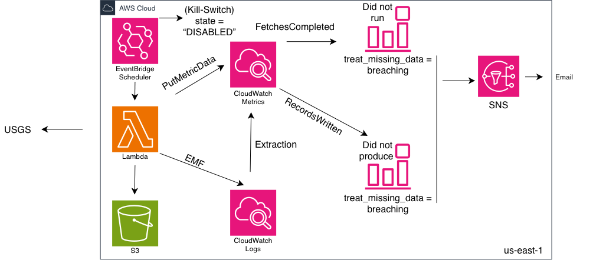

# Alarm on Absence

A small pipeline that pulls the USGS earthquake feed every 15 minutes,
writes it to S3, and watches itself with two alarms instead of one.

Most monitoring answers one question: *is anything broken?* This answers
a second one that gets skipped almost everywhere: *is the thing that's
supposed to run, actually still producing anything?* A system can be
running, throwing zero errors, and quietly doing nothing — and a normal
alarm stays green the whole time, because there's nothing to trigger on.
This project treats that silence itself as the failure.

## The idea, in one line

Every run publishes two custom metrics, not one:

- **`FetchesCompleted`** — did the job even run?
- **`RecordsWritten`** — did it actually produce something?

Two alarms watch them, and both are configured with
`treat_missing_data = breaching`. If either metric stops arriving —
because the schedule died, because the code crashed, because anything
upstream broke — the *absence* of data is what fires the alarm. Not a
bad value. The missing value.

## Architecture



EventBridge Scheduler invokes a Lambda every 15 minutes. The Lambda
publishes `FetchesCompleted` first, unconditionally, before it does
anything else — so even if the fetch or the write fails halfway, the
first metric is already out. It then pulls the feed, writes the raw
response to S3, and publishes `RecordsWritten` with the count (zero is
a valid, healthy answer — it means nothing happened, not that
something broke). The same metric also reaches CloudWatch through a
second dialect (EMF via CloudWatch Logs), so the two alarms have two
independent paths in.

Everything runs on the free tier. No public IPv4 anywhere in the
account.

## What's actually worth reading here

**The IAM policy was built by reading denials, not by guessing.**
The Lambda's role started with logs permissions only. Every other
permission — `cloudwatch:PutMetricData` scoped to one namespace,
`s3:PutObject` scoped to one bucket's objects — got added after a real
`AccessDenied` error named exactly what was missing. Nothing in the
policy is there "just in case." `TROUBLESHOOTING.md` has the actual
error messages.

**The alarms have been proven to fire, on purpose.** I disabled the
schedule, waited past a full missing period plus CloudWatch's own
evaluation lag, and captured the state transition from AWS's own
history API — not a screenshot, the actual `describe-alarm-history`
output. See [`PROOF.md`](PROOF.md). Both alarms went `OK → ALARM` with
the reason `"no datapoints were received... treated as [Breaching]"` —
which is the whole design, confirmed by CloudWatch's evaluation engine,
not by me asserting it works.

**Not everything worked, and that's in the repo too.** The SNS email
subscription has never delivered a confirmation, on two different real
addresses, after ruling out every cause checkable from the CLI —
region, IAM, the topic itself, Gmail filters, a full topic recreation.
AWS doesn't expose delivery logs for SNS email, so this is genuinely
unresolved, not glossed over. `TROUBLESHOOTING.md` has the full
diagnostic trail. The alarms don't depend on it — their state is
verified directly, independent of whether the notification arrives.

## Cost

Effectively nothing. The whole thing sits inside the always-free tier:
under 10 CloudWatch custom metrics, under 5 GB of logs, Lambda and
EventBridge Scheduler invocations orders of magnitude below their free
allotments. A $10 monthly budget with a forecasted alert at 75% guards
against the one thing that *could* get expensive on purpose — see
below.

## Deliberately expensive, once, on purpose

Part of the build includes intentionally exploding CloudWatch's custom
metric cardinality (putting a request ID into a dimension set) to see
where $0.30 per unique series stops being cheaper than $0.50 per GB
under the alternate EMF/OTel path, then reverting it and reading the
real Cost Explorer line item. That's a planned, bounded, one-day
experiment — not an accident.

## Deploying it

```bash
cd bootstrap
terraform init
terraform apply          # creates the remote state bucket

cd ..
terraform init            # picks up the S3 backend
cp terraform.tfvars.example terraform.tfvars   # fill in your own alert email
terraform apply
```

The bootstrap state stays local on purpose — it's the recipe for the
backend, not application infrastructure. See `TROUBLESHOOTING.md` for
why, and for every mistake made building this, left in rather than
cleaned up.

## What's next

A second and third dialect for the same two metrics — native OTLP
metrics on CloudWatch, and Amazon Managed Prometheus with the same
alarm re-expressed in PromQL. CloudWatch and PromQL disagree on what
"missing data" means by default, which breaks this project's whole
premise on one of the four backends unless it's repaired on purpose.
That's the next thing to prove, not just claim.
